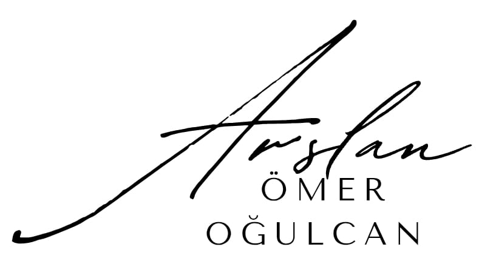

  

# 🧠 RFMiD Retina Hastalık Tespiti Projesi

> Retinal hastalıkları otomatik sınıflandıran derin öğrenme projesi.  

 

---

## 📂 Proje Yapısı

RFMiD-Retina-Projesi/
│
├─ main.py
├─ web app/
├─ model/
├─ data/
├─ notebooks/
├─ src/
├─ rapor/
├─ README.md
├─ LICENSE
└─ logo.png

---

## 🛠️ Kullanılan Teknolojiler

- Python 3.x  
- TensorFlow / Keras  
- Pandas, NumPy, Matplotlib  
- Google Colab (eğitim ve test için)  
- Web uygulaması için: Streamlit / Flask  

---

## 📊 Model Performansı

| Metrik                   | Değer      |
|---------------------------|-----------|
| Eğitim Doğruluğu          |  |
| Doğrulama Doğruluğu       |  |
| Test Doğruluğu            |  |
| AUC Skoru                 |  |
| Genel Başarı Metriği      |  |

---

## 🔍 Veri Seti

- **RFMiD** (RIADD Grand Challenge üzerinden indirilmiştir)  
- Retina fundus görüntüleri ve çoklu hastalık etiketleri içerir.  

---

## ⚡ Kullanım

1. `main.py` dosyasını çalıştırarak proje tüm klasörlerden bağımsız çalıştırılabilir.  
2. `web app/` klasöründeki dosyaları çalıştırarak demo web uygulamasını kullanabilirsiniz.  
3. `model/` klasöründeki eğitilmiş modeli kullanarak tahminler yapabilirsiniz.  
4. `notebooks/` klasöründeki Jupyter notebookları açarak modeli inceleyebilir veya eğitebilirsiniz.  
5. `src/` klasöründeki kodları kendi veri setinizle deneyebilirsiniz.  
6. `rapor/` klasöründe proje raporunu PDF ve DOC formatında bulabilirsiniz.  

---

## 📄 Lisans

Bu proje **akademik ve kişisel kullanım** içindir. Ticari kullanım için izin alınması gerekmektedir.  
Daha fazla bilgi için [LICENSE](LICENSE) dosyasına bakın.

